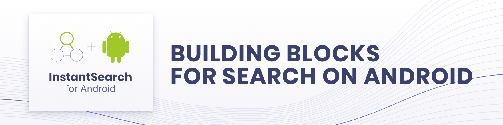

[  ](https://search.maven.org/search?q=a:instantsearch-android)
[](https://travis-ci.org/algolia/instantsearch-android)

InstantSearch family: **InstantSearch Android** | [InstantSearch iOS][instantsearch-ios-github] | [React InstantSearch][react-instantsearch-github] | [InstantSearch.js][instantsearch-js-github] | [Angular InstantSearch][instantsearch-angular-github] | [Vue InstantSearch][instantsearch-vue-github].

**InstantSearch Android** is a library providing widgets and helpers to help you build the best instant-search experience on Android with Algolia.
It is built on top of Algolia's [Kotlin API Client][kotlin-client] to provide you a high-level solution to quickly build various search interfaces.

# Examples

You can see InstantSearch Android in action in our [examples app][examples-url], have a look at it to see concrete examples of all the available widgets.

# Usage

## Installing InstantSearch Android

You can add InstantSearch to your Android application by adding the following line to your build.gradle's dependencies:

```groovy
dependencies {
	// [...]
	implementation "com.algolia:instantsearch-android:$instantsearch_version"
}
```

ℹ️ Please follow the [migration guide](docs/guide/Migration_2.x_3.x.md) to migrate from `2.x` to the latest version.

See the [documentation][doc]. You can start with the [Getting Started Guide][getting-started].

<!-- vale Google.Spacing = YES -->

### Compose

You can add [Compose UI](https://developer.android.com/jetpack/androidx/releases/compose-ui) support by adding the following line to your build.gradle's dependencies:

```groovy
dependencies {
	// [...]
	implementation "com.algolia:instantsearch-compose:$instantsearch_version"
}
```

### Paging 3

You can add [Paging 3](https://developer.android.com/topic/libraries/architecture/paging/v3-overview) support by adding the following line to your build.gradle's dependencies:

```groovy
dependencies {
	// [...]
	implementation "com.algolia:instantsearch-android-paging3:$instantsearch_version"
}
```

### Insights

You can add **InstantSearch Insights** to your Android application by adding the following line to your `build.gradle`'s dependencies.
```groovy
implementation "com.algolia:instantsearch-insights-android:$instantsearch_version"
```

## Requirements

* Kotlin 1.6+
* Android SDK 21+
* Java 8+

Please refer to the [library](instantsearch-insights/README.md) for more details.

### R8 / Proguard rules

If you use this library in an Android project which uses R8, there is nothing you have to do. The specific rules are 
already bundled into the JAR, which can be interpreted by R8 automatically.

If however, you don’t use R8, then you might need rules from [Algolia Kotlin Client](https://github.com/algolia/algoliasearch-client-kotlin#r8--proguard-rules) which is a dependency of this library.

## Telemetry
InstantSearch Android collects data points at runtime. This helps the InstantSearch team improve and prioritize future development.

Here's an exhaustive list of the collected data:

- InstantSearch version
- The name of the instantiated InstantSearch components, for example, `HitsSearcher`, `FilterState`
- The name of the components with custom parameters (overridden defaults). InstantSearch doesn't collect the values of those parameters. For example, the default of the `facets` value in `FacetListInteractor` is an empty list. If you instantiate it with a list of facets, then the telemetry tracks that the `facets` parameter received a custom value, but not the value itself.

InstantSearch doesn't collect any sensitive or personal data. However, you can still opt out of the telemetry collection with the following code:
```kotlin
Telemetry.shared.enabled = false
```

## Contributing

From [reporting bugs or missing functionality](https://github.com/algolia/instantsearch-android/issues/new) to [fixing a typo or proposing an improvement](https://github.com/algolia/instantsearch-android/compare), all contributions are welcome! Read the [Contributing Guide](https://github.com/algolia/instantsearch-android/blob/master/CONTRIBUTING.md) to setup your development environment.

## Troubleshooting

Encountering an issue? Before reaching out to support, we recommend heading to our [FAQ](https://www.algolia.com/doc/guides/building-search-ui/troubleshooting/faq/android/) where you will find answers for the most common issues and gotchas with the library.

# License

InstantSearch Android is [licensed under Apache V2](LICENSE).

[doc]: https://algolia.com/doc/guides/building-search-ui/what-is-instantsearch/android/
[getting-started]: https://algolia.com/doc/guides/building-search-ui/getting-started/android/
[kotlin-client]: https://github.com/algolia/algoliasearch-client-kotlin
[showcase-url]: https://algolia.com/doc/guides/building-search-ui/widgets/showcase/android/
[examples-url]: /examples
[react-instantsearch-github]: https://github.com/algolia/react-instantsearch/
[instantsearch-ios-github]: https://github.com/algolia/instantsearch-ios
[instantsearch-js-github]: https://github.com/algolia/instantsearch.js
[instantsearch-vue-github]: https://github.com/algolia/vue-instantsearch
[instantsearch-angular-github]: https://github.com/algolia/angular-instantsearch
