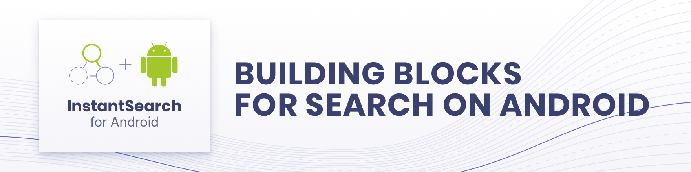

[](https://travis-ci.org/algolia/instantsearch-android)

InstantSearch family: **InstantSearch Android** | [InstantSearch iOS][instantsearch-ios-github] | [React InstantSearch][react-instantsearch-github] | [InstantSearch.js][instantsearch-js-github] | [Angular InstantSearch][instantsearch-angular-github] | [Vue InstantSearch][instantsearch-vue-github].

**InstantSearch Android** is a library providing widgets and helpers to help you build the best instant-search experience on Android with Algolia.
It is built on top of Algolia's [Kotlin API Client][kotlin-client] to provide you a high-level solution to quickly build various search interfaces.

# Demo
You can see InstantSearch Android in action in our [Examples repository][examples-url], in which we published two example apps built with InstantSearch:

| [Media app][media-url] | [E-commerce app][ecommerce-url] |
| --- | --- |
| [![animated screenshot of media app][media-gif]][media-url] | [![animated screenshot of e-commerce app][ecommerce-gif]][ecommerce-url] |

Have a look at our [widget showcase][showcase-url] to see concrete examples of all the available widgets.

# Usage

You can add InstantSearch to your Android application by adding the following line to your `build.gradle`'s dependencies.
```groovy
implementation 'com.algolia:instantsearch-android:2.0.0'
```
<!--TODO Document using helper-jvm / using core directly -->

See the [documentation][doc]. You can start with the [Getting Started Guide][getting-started].

# Contributing

From [reporting bugs or missing functionality](https://github.com/algolia/instantsearch-android/issues/new) to [fixing a typo or proposing an improvement](https://github.com/algolia/instantsearch-android/compare), all contributions are welcome! Read the [Contributing Guide](https://github.com/algolia/instantsearch-android/blob/master/CONTRIBUTING.md) to setup your development environment.

# License

InstantSearch Android is [MIT licensed](LICENSE.md).

[doc]: https://algolia.com/doc/guides/building-search-ui/what-is-instantsearch/android/
[getting-started]: https://algolia.com/doc/guides/building-search-ui/getting-started/android/
[kotlin-client]: https://github.com/algolia/algoliasearch-client-kotlin
[media-gif]: ./docs/media.gif
[ecommerce-gif]: ./docs/ecommerce.gif
[media-url]: https://github.com/algolia/instantsearch-android-examples/tree/master/media
[ecommerce-url]: https://github.com/algolia/instantsearch-android-examples/tree/master/ecommerce
[showcase-url]: https://algolia.com/doc/guides/building-search-ui/widgets/showcase/android/
[examples-url]: https://github.com/algolia/instantsearch-android-examples
[react-instantsearch-github]: https://github.com/algolia/react-instantsearch/
[instantsearch-ios-github]: https://github.com/algolia/instantsearch-ios
[instantsearch-js-github]: https://github.com/algolia/instantsearch.js
[instantsearch-vue-github]: https://github.com/algolia/vue-instantsearch
[instantsearch-angular-github]: https://github.com/algolia/angular-instantsearch
